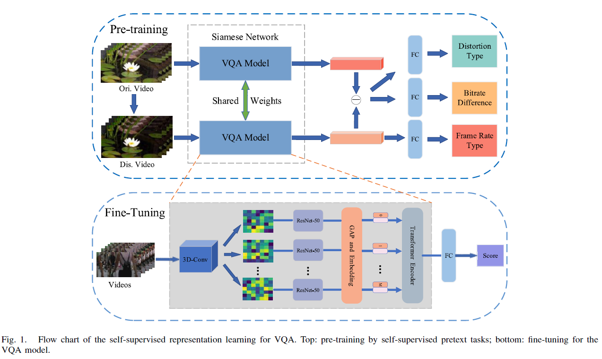

# Self-Supervised Representation Learning for Video Quality Assessment

## Description

Code for the **Self-Supervised Representation Learning for Video Quality Assessment**. The code are mostly based on [Swin-Transformer](https://github.com/microsoft/Swin-Transformer)、 [Vision Transformer](https://github.com/jeonsworld/ViT-pytorch) and [DVQA](https://github.com/Tencent/DVQA).

- S. Jiang, Q. Sang, Z. Hu and L. Liu, "Self-Supervised Representation Learning for Video Quality Assessment," *IEEE Transactions on Broadcasting*, 2022, doi: 10.1109/TBC.2022.3197904.

    

## Requirement

### Create Environment

```
conda create -n VQA python=3.8
conda activate VQA
```

### Install Pytorch and Tensorboard

```
# pytorch: 1.8.2
# CUDA 11.1 
# https://pytorch.org/get-started/locally/

conda install pytorch torchvision torchaudio cudatoolkit=11.1 -c pytorch-lts -c nvidia
```

```
conda install tensorboard
```

### Install the Requirements

```
# install the requirements:
pip install -r requirements.txt
```

- [Pytorch 1.8.2](https://pytorch.org/get-started/locally/)
- CUDA 11.1
- Python 3.8


## Self-supervised Database

We selected 310 videos of resolution 1280 × 720 pixels or larger from the [YouTube-8M](https://research.google.com/youtube8m/) database.

We provided the 310 original vidoes and the code for generation distortion videos.

### 310 original videos

[DownLoad Link](https://pan.baidu.com/s/1ibI2fizsJfb3HrR0Quekyg)

Password: rd0v

### Distortion generate

`./pretrained_database/make_dis.py`: modify the settings to satisfy your environment.

## Pre-train

`python3 pre_trained.py --batch-size=6 --batch-test=2 --frame=16 --model=pre_train --epoch=50 --base_lr=2e-4 --best=0.5`

## Fine-tuning

We provided the pre-trained weight on our self-supervised database for fine-tuning.

[DownLoad Link](https://pan.baidu.com/s/1hYpYld6GXzKbVV2RRPxG4w)

Password: lezn

## Tips

- change the **video path** in `getVQA.py`. e. g. `'/home1/server823-2/database/2D-Video/CSIQVideo'`

- `train_vqa_type` used for LIVE and CSIQ Database.

- `train_vqa_yuv` used for KoNVid-1k and LIVE-VQC Database.

- if you meet this problem:
    ```
    AttributeError: partially initialized module 'cv2' has no attribute '_registerMatType' (most likely due to a circular import)
    ```
    try this:
    ```
    pip intsall opencv_python_headless==4.2.0.34
    ```


### Run-srcipt

`TEST_*.sh`: train-test in *LIVE/CSIQ/KoNVid-1k/LIVE-VQC* Database. (**Both Fine-tuning and Baseline**)
`TRAIN_LIVE_TEST_OTHER.sh`: train on LIVE Database, test on other Databases.


## Demo

run `python3 demo.py` to get the predict for one test video. (You can modify the setting by yourself.)

## Contact me

My email address is jsss0624@163.com.
